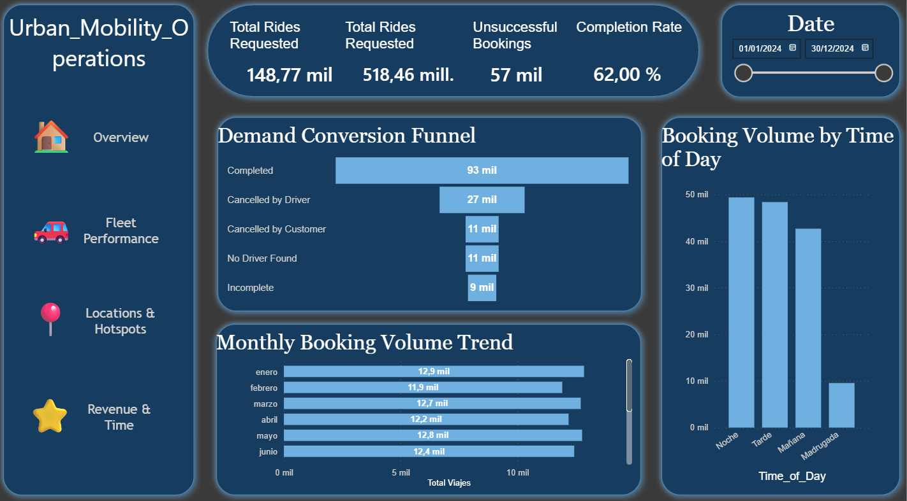

# 🚖 Urban Mobility & Revenue Leakage Analysis (2024)



*(Vista previa del Dashboard Operativo en Power BI)*

## 📌 Resumen del Proyecto
Este proyecto analiza la eficiencia operativa de una plataforma de Ride Hailing (tipo Uber/Cabify) en la región NCR. El objetivo principal fue diagnosticar las causas de la pérdida de ingresos (*Revenue Leakage*) y optimizar la asignación de la flota.

**Pregunta de Negocio:** ¿Cómo reducir la tasa de cancelación y minimizar la pérdida de ingresos por falta de conductores ("No Driver Found")?

---

## 🛠️ Tech Stack & Flujo de Trabajo

Este proyecto implementa una arquitectura ágil de **Modern Data Stack**, centrada en Python para el procesamiento de datos y Power BI para la inteligencia de negocios.

### 1. Python (Pandas & Seaborn) - ETL & EDA
* **Data Cleaning (ETL):** Se desarrolló un script robusto (`etl_analysis.py`) para sanear un dataset crudo con problemas de formato graves (comillas triples, tipos de datos inconsistentes y valores nulos).
* **Feature Engineering:**
    * **Revenue Estimation:** Se creó un algoritmo para imputar el valor monetario perdido en viajes cancelados, basado en el ticket promedio histórico de la flota.
    * **Time Segmentation:** Transformación de timestamps en franjas horarias de negocio (Morning, Afternoon, Night) para detectar patrones de demanda insatisfecha.
* **Automated Visualization:** Generación automática de gráficos estáticos (`.png`) para reportes rápidos de Tasa de Éxito.

### 2. Power BI - Executive Dashboard
* **App-Like Design:** Diseño de navegación estilo aplicación con 4 páginas interconectadas (*Overview, Fleet, Location, Revenue*).
* **Advanced DAX Measures:**
    * Cálculo de *Success Rate %* (Tasa de Éxito).
    * Cálculo de *Revenue Leakage* (Dinero perdido por ineficiencia).
* **Storytelling:**
    * **Demand Funnel:** Visualización del embudo de conversión para detectar dónde caen las reservas.
    * **Geospatial Analysis:** Mapas de calor para identificar "zonas rojas" de alta cancelación.

---

## 📊 Hallazgos Clave (Key Insights)

1.  **El "Villano" de la Flota:** Las **Motos (eBikes)** y los **Auto-Rickshaws** presentan la tasa de éxito más baja (<40%), siendo el principal punto de dolor en la experiencia del usuario. En contraste, **Uber XL** es el servicio más confiable.
2.  **Fuga de Ingresos:** El estado *"No Driver Found"* representa la mayor pérdida financiera, superando a las cancelaciones por parte del cliente. Esto indica un problema de **oferta (supply)** y no de demanda.
3.  **Patrones Críticos:** La mayor cantidad de viajes perdidos ocurre durante la **Noche**, sugiriendo la necesidad de incentivos dinámicos para conductores en ese turno.

---

## 📂 Estructura del Repositorio

```text
Ride_Hailing_Analysis/
├── data/                  # Dataset original (Raw) y Dataset limpio (Processed)
├── python/                # Script ETL y análisis exploratorio (Pandas)
├── powerbi/               # Archivo .pbix (Dashboard Interactivo)
├── dashboard_preview.png  # Captura del reporte final
└── README.md              # Documentación del proyecto
